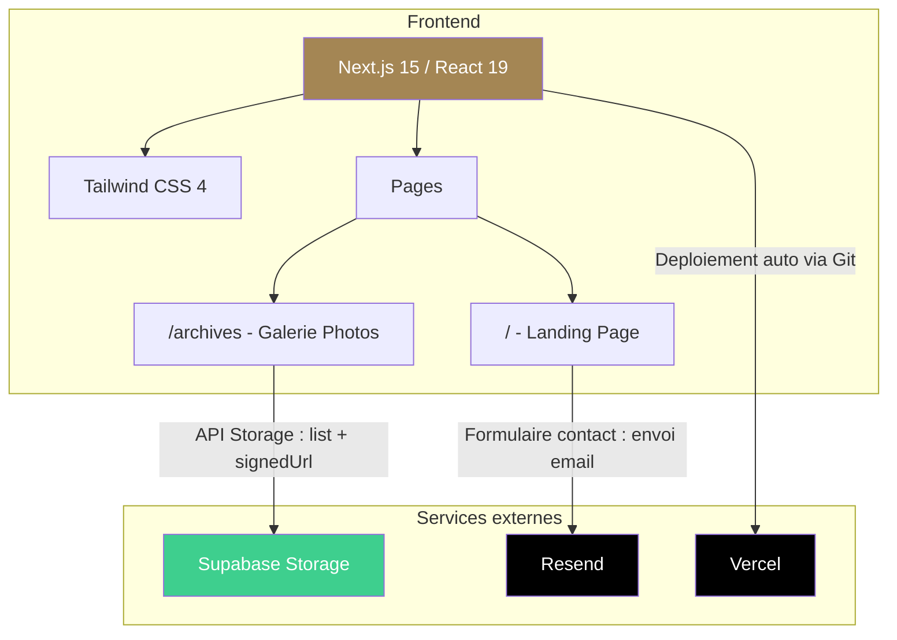
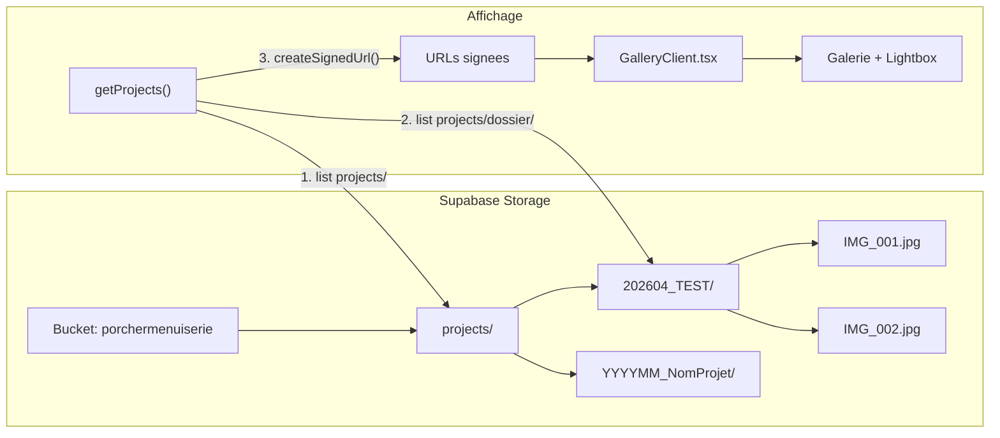
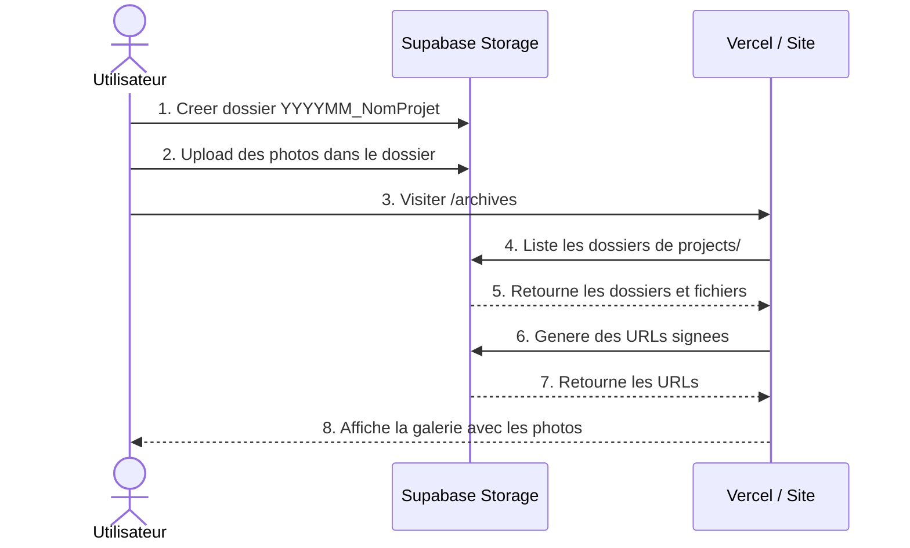

# Porcher Menuiserie - Site Vitrine

Site vitrine pour Porcher Menuiserie, entreprise de menuiserie et agencement sur mesure en Ille-et-Vilaine.

## Architecture





## Stack technique

| Outil | Usage |
|-------|-------|
| **Next.js 15** | Framework React SSR |
| **Tailwind CSS 4** | Styling |
| **Supabase Storage** | Hebergement des photos (galerie archives) |
| **Resend** | Envoi des emails du formulaire de contact |
| **Vercel** | Hebergement et deploiement |

---

## Installation locale

### 1. Cloner le projet

```bash
git clone <url-du-repo>
cd porchermenuiserie
npm install
```

### 2. Variables d'environnement

Creer un fichier `.env.local` a la racine :

```env
# Resend (envoi d'emails)
RESEND_API_KEY=re_xxxxx
EMAIL_TO=email@destination.fr

# Supabase (stockage photos)
NEXT_PUBLIC_SUPABASE_URL=https://xxxxxx.supabase.co
NEXT_PUBLIC_SUPABASE_PUBLISHABLE_KEY=sb_publishable_xxxxx
```

### 3. Lancer le serveur

```bash
npm run dev
```

Le site est accessible sur `http://localhost:3000`

---

## Configuration des services

### Resend (emails)

1. Creer un compte sur [resend.com](https://resend.com)
2. Aller dans **API Keys** > **Create API Key**
3. Copier la cle dans `RESEND_API_KEY`
4. Ajouter et verifier votre domaine dans **Domains** (ou utiliser le domaine sandbox pour les tests)
5. Mettre l'email de destination dans `EMAIL_TO`

### Supabase (photos)

#### Creer le projet

1. Creer un compte sur [supabase.com](https://supabase.com)
2. Creer un nouveau projet (region EU West recommandee)
3. Recuperer les credentials dans **Settings > API Keys** :
   - `Project URL` → `NEXT_PUBLIC_SUPABASE_URL`
   - `Publishable key` → `NEXT_PUBLIC_SUPABASE_PUBLISHABLE_KEY`

#### Creer le bucket Storage

1. Aller dans **Storage** (menu de gauche)
2. Cliquer **New bucket**
3. Nom : `porchermenuiserie`
4. Laisser les options par defaut
5. **Save**

#### Configurer les permissions (OBLIGATOIRE)

Le bucket doit etre accessible en lecture pour que le site affiche les photos.

1. Aller dans **Storage > Policies** (onglet en haut)
2. Cliquer **New policy** sur le bucket `porchermenuiserie`
3. Choisir **For full customization**
4. Remplir :
   - **Policy name** : `public read`
   - **Allowed operation** : **SELECT** (cocher uniquement)
   - **Target roles** : laisser par defaut (public)
   - **Policy definition** : `bucket_id = 'porchermenuiserie'`
5. **Save**

#### Organiser les photos

Structure des dossiers dans le bucket :

```
porchermenuiserie/          (bucket)
  projects/                 (dossier racine)
    202604_TEST/            (dossier projet - format YYYYMM_Nom)
      IMG_001.jpg
      IMG_002.jpg
    202503_Vern/
      photo1.jpg
      photo2.jpg
```

- Chaque sous-dossier de `projects/` = un projet affiche sur la page Archives
- Le nom du dossier est converti en titre (ex: `202604_TEST` → `202604 Test`)
- Formats acceptes : JPG, PNG, WebP

#### Ajouter des photos

1. Aller dans **Storage > porchermenuiserie > projects**
2. Cliquer **Create folder** pour un nouveau projet
3. Entrer dans le dossier
4. Cliquer **Upload files** et selectionner les photos

### Vercel (deploiement)

#### Premier deploiement

1. Creer un compte sur [vercel.com](https://vercel.com)
2. Cliquer **Add New > Project**
3. Importer le repo Git (GitHub/GitLab)
4. Dans **Environment Variables**, ajouter :
   - `RESEND_API_KEY`
   - `EMAIL_TO`
   - `NEXT_PUBLIC_SUPABASE_URL`
   - `NEXT_PUBLIC_SUPABASE_PUBLISHABLE_KEY`
5. Cliquer **Deploy**

#### Deploiements suivants

Chaque `git push` sur la branche `main` declenche automatiquement un nouveau deploiement.

```bash
git add .
git commit -m "description des changements"
git push
```

#### Domaine personnalise (optionnel)

1. Aller dans le projet Vercel > **Settings > Domains**
2. Ajouter votre domaine (ex: `porchermenuiserie.fr`)
3. Configurer les DNS chez votre registrar selon les instructions Vercel

---

## Flux de travail pour ajouter un nouveau projet photo



> Pas besoin de redployer le site ! Les nouvelles photos apparaissent automatiquement.

---

## Structure du projet

```
src/
  app/
    page.tsx              # Landing page
    layout.tsx            # Layout global
    Navigation.tsx        # Barre de navigation
    ContactForm.tsx       # Formulaire de contact
    CopyableContact.tsx   # Telephone/email copiables
    globals.css           # Styles globaux + theme
    archives/
      page.tsx            # Page galerie (server component)
      GalleryClient.tsx   # Galerie interactive + lightbox (client component)
    actions/
      sendEmail.ts        # Server action pour l'envoi d'email
  lib/
    supabase.ts           # Client Supabase
```
